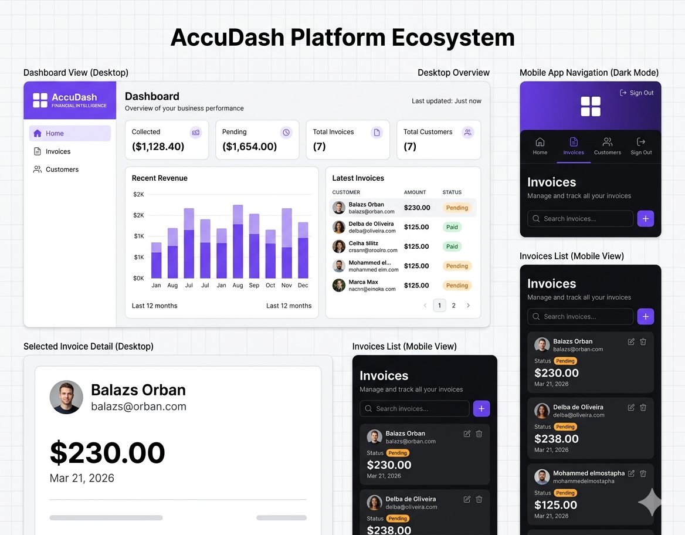
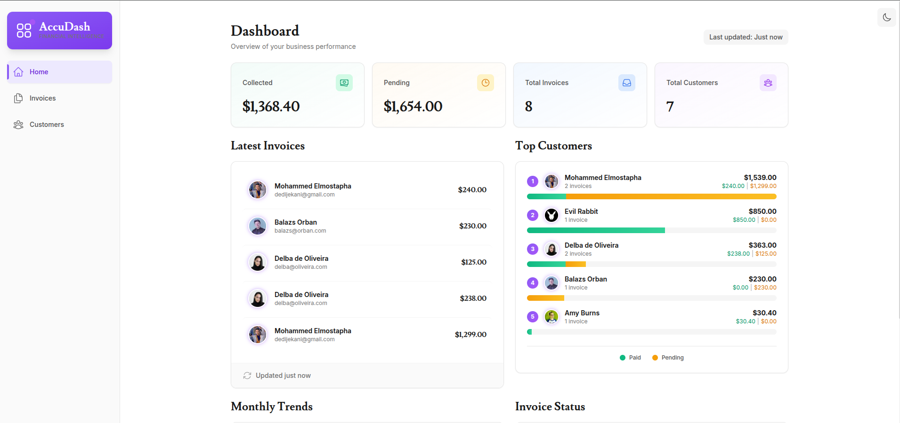
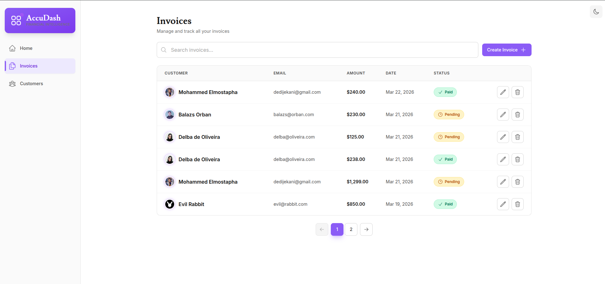
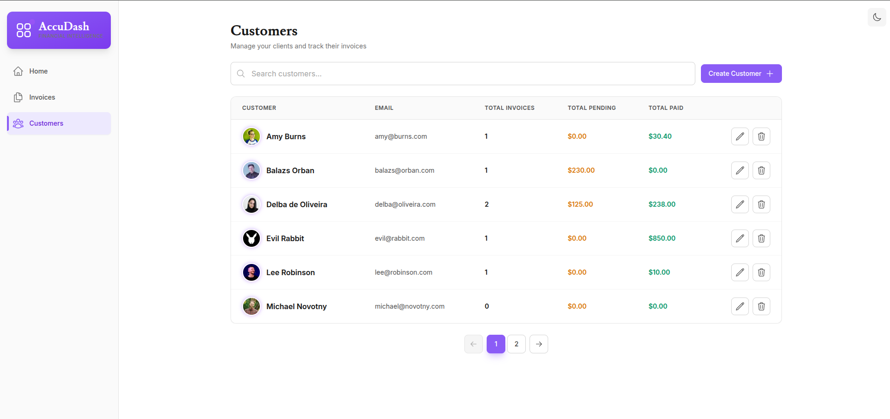

# 💼 AccuDash - Financial Intelligence Dashboard

A modern, full-stack financial management dashboard built with Next.js 16, featuring real-time invoice tracking, customer management, and AI-powered analytics.



## 🌟 Features

### Core Features
- 📊 **Dashboard Overview** - Real-time financial metrics and analytics
- 💳 **Invoice Management** - Full CRUD operations for invoices
  - Create, edit, and delete invoices
  - Track payment status (Pending/Paid)
  - Search and pagination
  - Mobile-responsive design
- 👥 **Customer Management** - Complete customer database
  - Customer profiles with stats
  - Track total invoices, pending, and paid amounts
  - Create and edit customer information
  - Default avatar support
- 🔐 **Authentication System**
  - Secure login with NextAuth v5
  - User registration with email verification
  - Auto-login after signup
  - Protected routes with middleware
- 🎨 **Premium UI/UX**
  - Modern gradient-based design system
  - Smooth animations and transitions
  - Avatar gradient rings
  - Interactive hover states
- 🌙 **Dark Mode**
  - System-wide dark mode support
  - Persistent theme preference
  - Smooth theme transitions
  - CSS variable-based theming
- 📱 **Fully Responsive**
  - Mobile-first design
  - Adaptive layouts for all screen sizes
  - Touch-optimized interactions

### Advanced Features (Coming Soon)
- 🤖 **AI Assistant** - Intelligent financial insights and predictions
  - Natural language queries
  - Invoice trend analysis
  - Payment prediction
  - Smart recommendations
- 📈 **Analytics Dashboard** - Advanced data visualization
- 📧 **Email Notifications** - Payment reminders and updates
- 📄 **PDF Generation** - Export invoices as PDF

---

## 🛠️ Tech Stack

### Frontend
- **Framework:** Next.js 16.0.10 (App Router, Turbopack)
- **Language:** TypeScript 5.7.3
- **Styling:** Tailwind CSS 3.4.17
- **UI Components:** Custom design system
- **Icons:** Heroicons
- **Fonts:** Inter, Lusitana (Google Fonts)

### Backend
- **Runtime:** Node.js
- **Database:** PostgreSQL (Vercel Postgres/Neon)
- **ORM:** Vercel Postgres SDK
- **Authentication:** NextAuth.js v5.0.0-beta.30
- **Validation:** Zod
- **Password Hashing:** bcrypt

### Developer Tools
- **Package Manager:** pnpm
- **Linting:** ESLint (Next.js config)
- **Git Hooks:** Husky (optional)

---

## 🚀 Getting Started

### Prerequisites
- Node.js 18.17 or later
- pnpm (recommended) or npm
- PostgreSQL database (Vercel Postgres or Neon recommended)

### Installation

1. **Clone the repository**
```bash
  git clone https://github.com/med-mostapha/AccuDash.git
  cd accudash
```

2. **Install dependencies**
```bash
   pnpm install
```

3. **Set up environment variables**
   
   Create a `.env` file in the root directory:
```env
   # Database (Vercel Postgres or Neon)
   POSTGRES_URL="postgresql://..."
   POSTGRES_PRISMA_URL="postgresql://..."
   POSTGRES_URL_NO_SSL="postgresql://..."
   POSTGRES_URL_NON_POOLING="postgresql://..."
   POSTGRES_USER="..."
   POSTGRES_HOST="..."
   POSTGRES_PASSWORD="..."
   POSTGRES_DATABASE="..."

   # Auth
   AUTH_SECRET="your-secret-key-here"
   NEXTAUTH_URL="http://localhost:3000"
   AUTH_TRUST_HOST="true"
```

4. **Generate AUTH_SECRET**
```bash
   openssl rand -base64 32
```

5. **Seed the database**
   
   Visit `http://localhost:3000/seed` to populate with sample data

6. **Run development server**
```bash
   pnpm dev
```

7. **Open the app**
   
   Navigate to [http://localhost:3000](http://localhost:3000)

---

## 📦 Database Schema

### Tables
- **users** - User accounts and authentication
- **customers** - Customer information and profiles
- **invoices** - Invoice records with status tracking
- **revenue** - Monthly revenue data for charts

### Sample Data
The seed script creates:
- 1 demo user account
- 10+ sample customers
- 15+ sample invoices
- 12 months of revenue data

---

## 🔑 Demo Credentials
```
Email: user@nextmail.com
Password: 123456
```

**Note:** This is a demo application with shared data across all users. In production, each user would have isolated data.

---

## 📸 Screenshots

### Dashboard Overview


### Invoice Management


### Customer Management


### Dark Mode


---

## 🎨 Design System

### Color Palette
- **Primary:** Violet/Indigo (#6C63FF)
- **Accent:** Pink/Purple (#9D4EDD)
- **Neutral:** Gray scale with dark mode variants

### Typography
- **Sans:** Inter
- **Display:** Lusitana

### Components
- Reusable Button component (5 variants)
- Card component (4 variants)
- Container component (responsive)
- Gradient text animations
- Glass morphism effects

---

## 📂 Project Structure
```
nextjs-dashboard/
├── app/
│   ├── (auth)/              # Auth routes (login, signup)
│   ├── dashboard/           # Dashboard routes
│   │   ├── (overview)/      # Dashboard home
│   │   ├── customers/       # Customer management
│   │   └── invoices/        # Invoice management
│   ├── lib/
│   │   ├── actions/         # Server actions
│   │   │   ├── auth.ts
│   │   │   ├── customers.ts
│   │   │   └── invoices.ts
│   │   ├── data.ts          # Data fetching functions
│   │   ├── definitions.ts   # TypeScript types
│   │   └── utils.ts         # Utility functions
│   ├── providers/           # React context providers
│   ├── ui/                  # UI components
│   │   ├── auth/            # Auth components
│   │   ├── customers/       # Customer components
│   │   ├── dashboard/       # Dashboard components
│   │   ├── design-system/   # Reusable components
│   │   └── invoices/        # Invoice components
│   └── layout.tsx           # Root layout
├── public/                  # Static assets
├── auth.config.ts           # NextAuth configuration
├── auth.ts                  # NextAuth instance
├── middleware.ts            # Route protection
├── next.config.ts           # Next.js configuration
├── tailwind.config.ts       # Tailwind CSS configuration
└── tsconfig.json            # TypeScript configuration
```

---

## 🚢 Deployment

### Deploy to Vercel (Recommended)

1. **Push to GitHub**
```bash
   git push origin main
```

2. **Import to Vercel**
   - Go to [vercel.com](https://vercel.com)
   - Click "Import Project"
   - Select your repository
   - Add environment variables
   - Deploy!

3. **Update NEXTAUTH_URL**
```env
   NEXTAUTH_URL=https://your-app.vercel.app
```

### Manual Deployment
```bash
# Build for production
pnpm build

# Start production server
pnpm start
```

---

## 🔮 Roadmap

### Phase 1: Core Features ✅
- [x] Dashboard with real-time metrics
- [x] Invoice CRUD operations
- [x] Customer management
- [x] Authentication system
- [x] Dark mode
- [x] Responsive design

### Phase 2: Advanced Features (In Progress)
- [ ] AI Assistant integration
- [ ] Multi-tenancy (user-specific data)
- [ ] Customer details page
- [ ] Advanced analytics
- [ ] Email notifications

### Phase 3: Enterprise Features (Planned)
- [ ] PDF invoice generation
- [ ] File upload for avatars
- [ ] Batch operations
- [ ] Export to CSV/Excel
- [ ] API documentation
- [ ] Testing suite (Jest/Vitest)

---

## 🤝 Contributing

Contributions are welcome! Please feel free to submit a Pull Request.

1. Fork the project
2. Create your feature branch (`git checkout -b feature/AmazingFeature`)
3. Commit your changes (`git commit -m 'Add some AmazingFeature'`)
4. Push to the branch (`git push origin feature/AmazingFeature`)
5. Open a Pull Request

---

## 📝 License

This project is licensed under the MIT License - see the [LICENSE](LICENSE) file for details.

---

## 👨‍💻 Author

**Mohamed Elmoustapha**
- GitHub: [@med-mostapha](https://github.com/med-mostapha)
- LinkedIn: [Mohamed Elmoustapha](https://www.linkedin.com/in/mohamed-elmostapha-mohamed-209645343/)
- Portfolio: [https://accudash.vercel.app](https://accudash.vercel.app)

---

## 🙏 Acknowledgments

- Built with [Next.js](https://nextjs.org/)
- UI inspiration from modern SaaS dashboards
- Database powered by [Vercel Postgres](https://vercel.com/storage/postgres)
- Authentication by [NextAuth.js](https://next-auth.js.org/)


